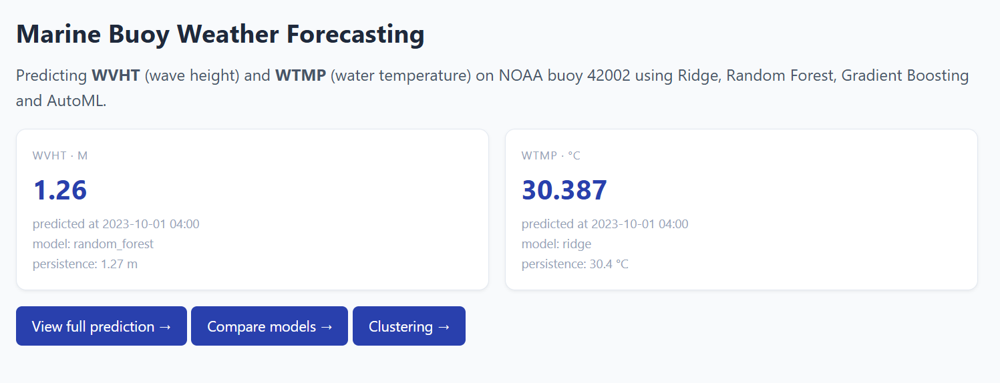
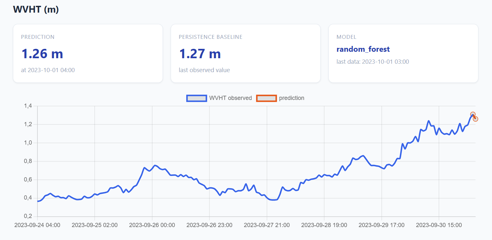
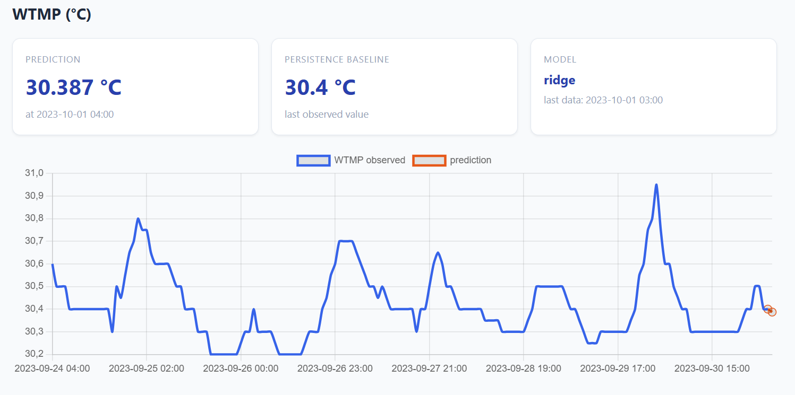
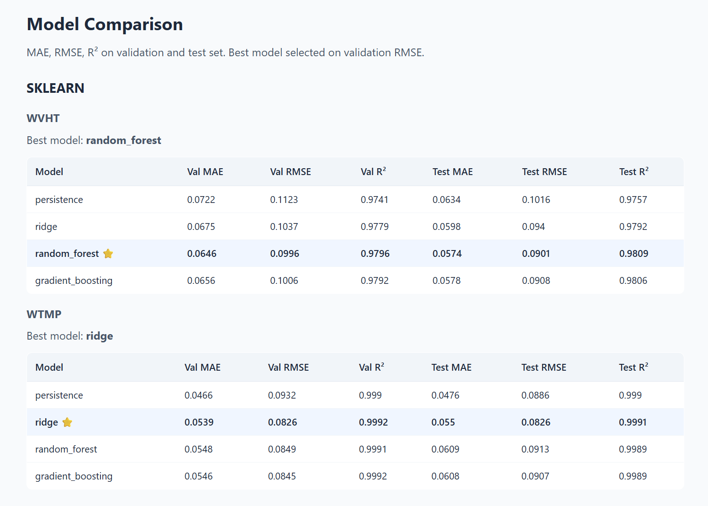
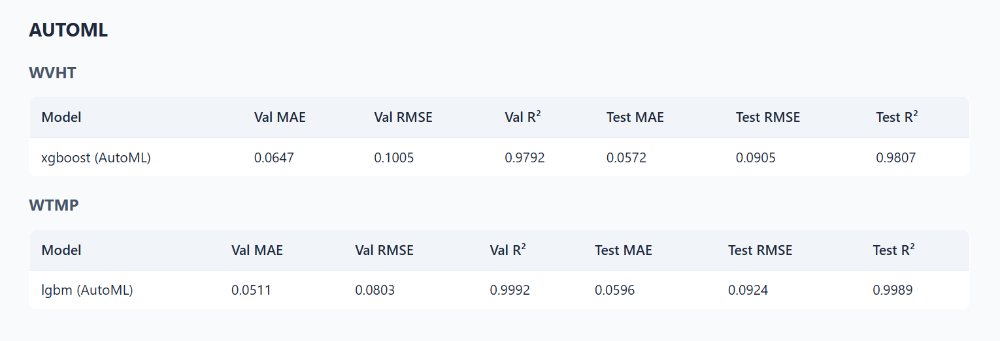
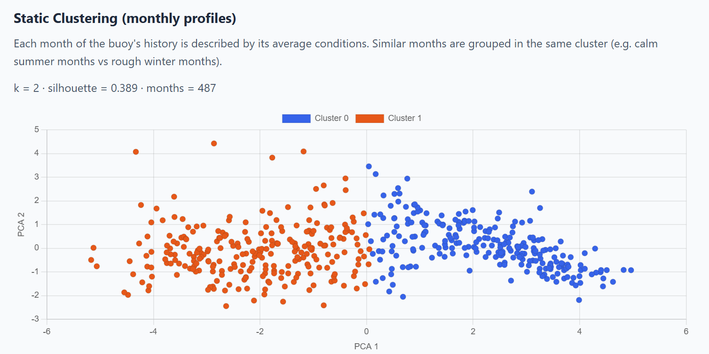
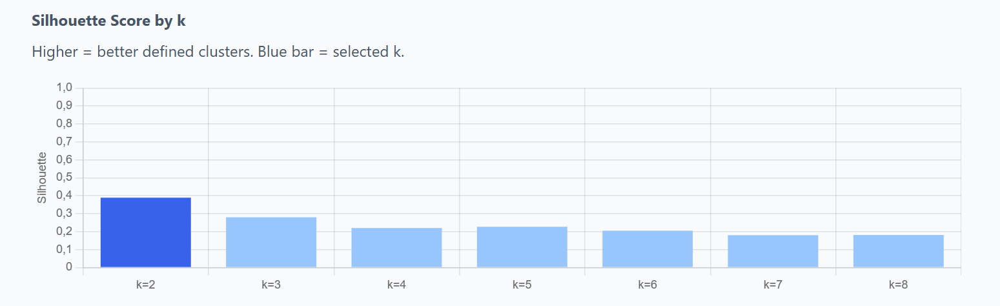
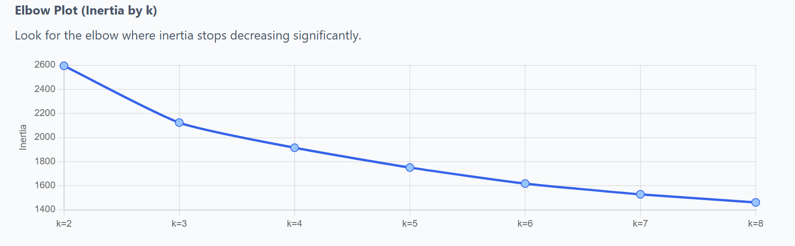
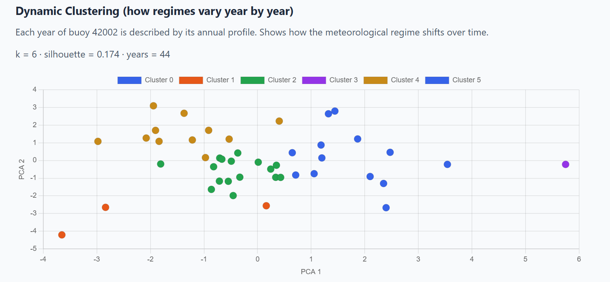
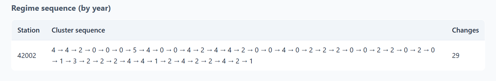

# Marine Buoy Weather Forecasting

Time-series forecasting of **WVHT** (significant wave height, m) and **WTMP** (water temperature, °C) on NOAA buoy 42002 using machine learning regression models and AutoML. Includes temporal clustering analysis to identify recurring meteorological regimes and how they evolve over time. The entire project runs inside a single Docker container exposing a FastAPI REST backend and a FastAPI HTML frontend.

## Dataset

**[`Qdrant/NOAA-Buoy`](https://huggingface.co/datasets/Qdrant/NOAA-Buoy)** on Hugging Face — buoy 42002, Gulf of Mexico (26°N, 93°W), hourly measurements from **1980 to 2023** (~344,000 observations after cleaning and hourly resampling).

> **Note:** `load_dataset()` fails on this repo due to inconsistent CSV column names across monthly files. `load.py` downloads the processed `.parquet` files directly via `huggingface_hub`, bypassing `load_dataset` entirely.

**Variables:** `WDIR`, `WSPD`, `GST` (wind), `WVHT`, `DPD`, `APD`, `MWD` (waves), `PRES`, `ATMP`, `WTMP` (atmosphere/sea).

## Project Structure

```
src/
  load.py          → download buoy 42002 from Qdrant/NOAA-Buoy (Hugging Face)
  clean.py         → physical bounds filtering, hourly resampling
  features.py      → lag features, rolling stats, cyclic calendar, temporal split 70/15/15
  models.py        → persistence baseline, Ridge, RandomForest, GradientBoosting
  automl.py        → FLAML AutoML with time-based cross-validation (60s budget)
  clustering.py    → KMeans on monthly (static) and yearly (dynamic) profiles
  predictor.py     → inference layer, loads .joblib bundles, reads clustering outputs
API_App/
  backend/main.py  → FastAPI REST API — port 8080
  backend/schemas.py → Pydantic request/response models
  frontend/main.py → FastAPI HTML frontend (Jinja2 + Chart.js) — port 8000
  frontend/templates/ → HTML templates (base, index, prediction, comparison, clustering)
  static/style.css → stylesheet
  Dockerfile       → single image, supervisord starts both backend and frontend
  supervisord.conf → process manager configuration
notebooks/
  summary.ipynb    → step-by-step analysis, model comparison, clustering visualization
results/           → screenshots and plots from the running application
requirements.txt
```

## Models Compared

| Model | Description |
|---|---|
| Persistence | Naive baseline: ŷ(t+1) = y(t). No training required. |
| Ridge | Linear regression with L2 regularization. Requires StandardScaler. |
| Random Forest | Bagging ensemble of decision trees. Reduces variance. |
| Gradient Boosting | Sequential boosting ensemble. Reduces bias. |
| AutoML (FLAML) | Automatic model and hyperparameter search, 60s budget, time-based CV. |

**Selection criterion:** best model chosen on **validation RMSE** (test set used only once for final evaluation).

## Results

### Forecasting — WVHT (wave height)

The best model for WVHT is **Random Forest** (selected on validation RMSE):

| Model | Val MAE | Val RMSE | Val R² | Test MAE | Test RMSE | Test R² |
|---|---|---|---|---|---|---|
| persistence | 0.0722 | 0.1123 | 0.9741 | 0.0634 | 0.1016 | 0.9757 |
| ridge | 0.0675 | 0.1037 | 0.9779 | 0.0598 | 0.0940 | 0.9792 |
| **random_forest ⭐** | **0.0646** | **0.0996** | **0.9796** | **0.0574** | **0.0901** | **0.9809** |
| gradient_boosting | 0.0656 | 0.1006 | 0.9792 | 0.0578 | 0.0908 | 0.9806 |
| xgboost (AutoML) | 0.0647 | 0.1005 | 0.9792 | 0.0572 | 0.0905 | 0.9807 |

Random Forest achieves **R² = 0.9809** on the test set, improving RMSE by **11.3%** over the persistence baseline. WVHT is highly predictable due to strong short-term autocorrelation — lag features (especially lag1) capture most of the signal.

### Forecasting — WTMP (water temperature)

The best model for WTMP is **Ridge** (selected on validation RMSE):

| Model | Val MAE | Val RMSE | Val R² | Test MAE | Test RMSE | Test R² |
|---|---|---|---|---|---|---|
| persistence | 0.0466 | 0.0932 | 0.9990 | 0.0476 | 0.0886 | 0.9990 |
| **ridge ⭐** | **0.0539** | **0.0826** | **0.9992** | **0.0550** | **0.0826** | **0.9991** |
| random_forest | 0.0548 | 0.0849 | 0.9991 | 0.0609 | 0.0913 | 0.9989 |
| gradient_boosting | 0.0546 | 0.0845 | 0.9992 | 0.0608 | 0.0907 | 0.9989 |
| lgbm (AutoML) | 0.0511 | 0.0803 | 0.9992 | 0.0596 | 0.0924 | 0.9989 |

Ridge achieves **R² = 0.9991** on the test set. WTMP has extremely high autocorrelation (water temperature changes slowly), making it very predictable at 1-hour horizon.

### Clustering

**Static clustering (monthly profiles):** KMeans with k=2 (best silhouette = 0.389, 487 monthly profiles). Two well-separated regimes identified over the full 1980–2023 history of buoy 42002: Cluster 0 (summer months — calm sea, warm water) and Cluster 1 (winter months — rough sea, colder water). The silhouette plot confirms k=2 as the optimal choice; the elbow plot shows a clear bend at k=2.

**Dynamic clustering (yearly profiles):** KMeans with k=6 (silhouette = 0.174, 44 yearly profiles). Each year is described by its annual average conditions. The regime sequence shows **29 regime changes** over 44 years, indicating the buoy's meteorological conditions have varied considerably from decade to decade. Years in the same cluster share similar annual average values of WVHT, WTMP, WSPD, PRES and ATMP.












## Run with Docker

All commands must be run from the **project root** (the folder containing `src/` and `API_App/`).

### Build the image (once, or after code changes)
```bash
docker build -f API_App/Dockerfile -t marine-buoy .
```

### Run the full pipeline (download data + train models)

**Linux / macOS:**
```bash
docker run --rm \
  -v "$PWD/data:/app/data" \
  -v "$PWD/models:/app/models" \
  marine-buoy bash -c "
    python src/load.py &&
    python src/clean.py &&
    python src/features.py &&
    python src/models.py &&
    python src/automl.py 60 &&
    python src/clustering.py"
```

**Windows (PowerShell):**
```powershell
docker run --rm -v "C:\path\to\project\data:/app/data" -v "C:\path\to\project\models:/app/models" marine-buoy bash -c "python src/load.py && python src/clean.py && python src/features.py && python src/models.py && python src/automl.py 60 && python src/clustering.py"
```

### Start the application

**Linux / macOS:**
```bash
docker run --rm -p 8000:8000 -p 8080:8080 \
  -v "$PWD/data:/app/data" \
  -v "$PWD/models:/app/models" \
  marine-buoy
```

**Windows (PowerShell):**
```powershell
docker run --rm -p 8000:8000 -p 8080:8080 -v "C:\path\to\project\data:/app/data" -v "C:\path\to\project\models:/app/models" marine-buoy
```

- Frontend → **http://localhost:8000**
- Backend API docs → **http://localhost:8080/docs**

### Pull from GitHub Container Registry (no build needed)
```bash
docker pull ghcr.io/brusca01/marine-buoy-forecasting:latest
docker run --rm -p 8000:8000 -p 8080:8080 \
  -v "$PWD/data:/app/data" \
  -v "$PWD/models:/app/models" \
  ghcr.io/brusca01/marine-buoy-forecasting:latest
```

## API Endpoints

| Method | Endpoint | Description |
|---|---|---|
| GET | `/api/health` | Service status |
| GET/POST | `/api/predict` | WVHT + WTMP forecast at t+1h |
| GET | `/api/comparison` | MAE/RMSE/R² for all models |
| GET | `/api/clusters/static` | Monthly clustering results |
| GET | `/api/clusters/dynamic` | Yearly clustering results |

## GitHub Container Registry

```bash
docker tag marine-buoy ghcr.io/brusca01/marine-buoy-forecasting:latest
echo YOUR_TOKEN | docker login ghcr.io -u Brusca01 --password-stdin
docker push ghcr.io/brusca01/marine-buoy-forecasting:latest
```
