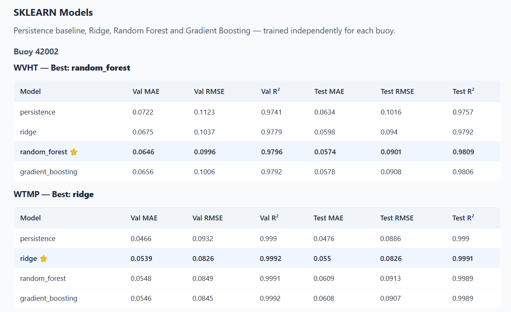
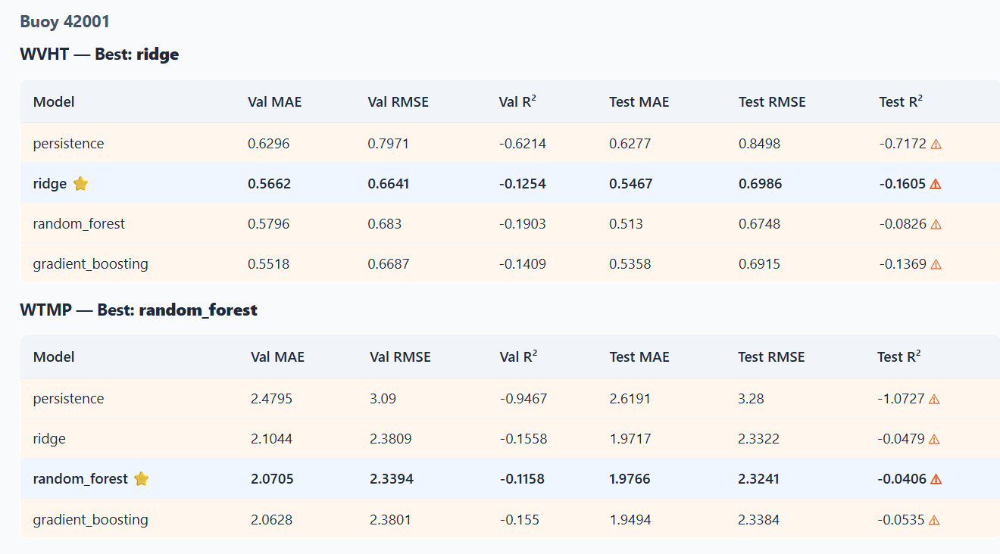
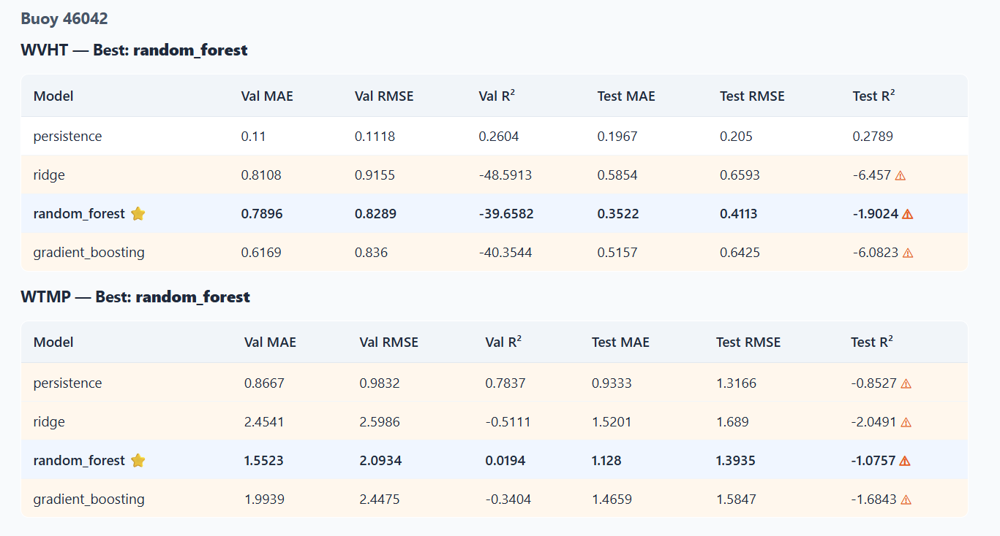
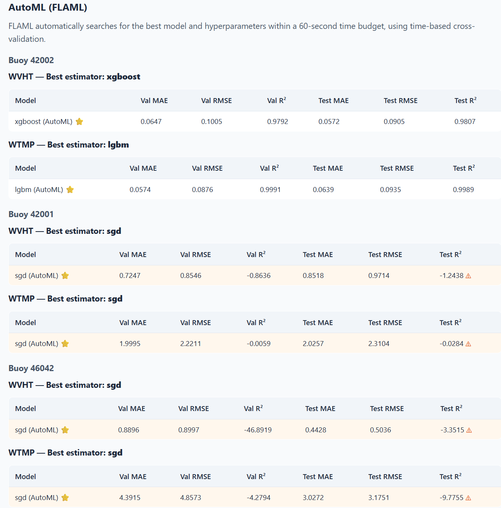
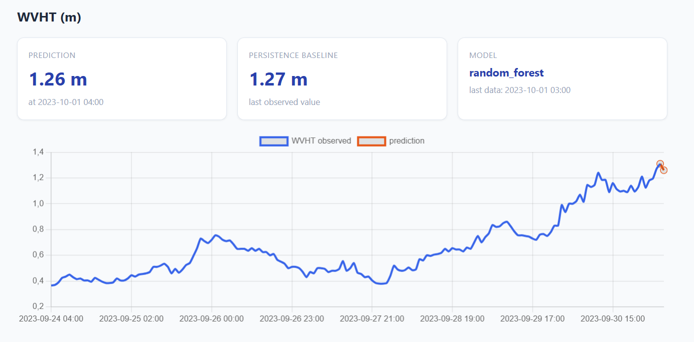
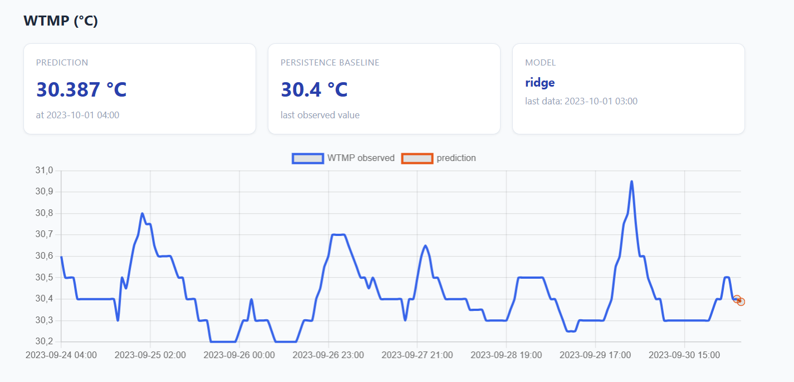
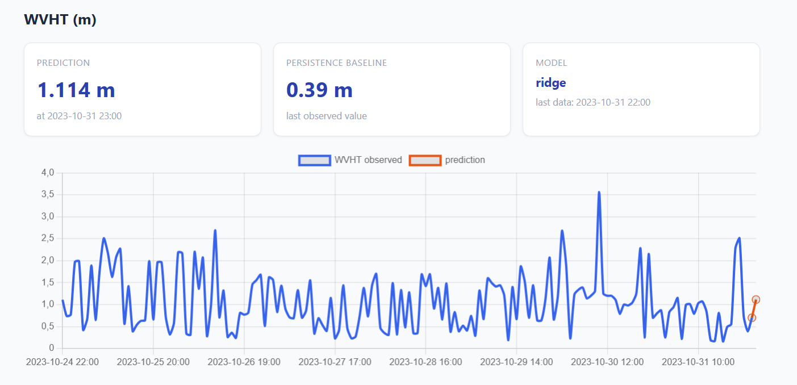
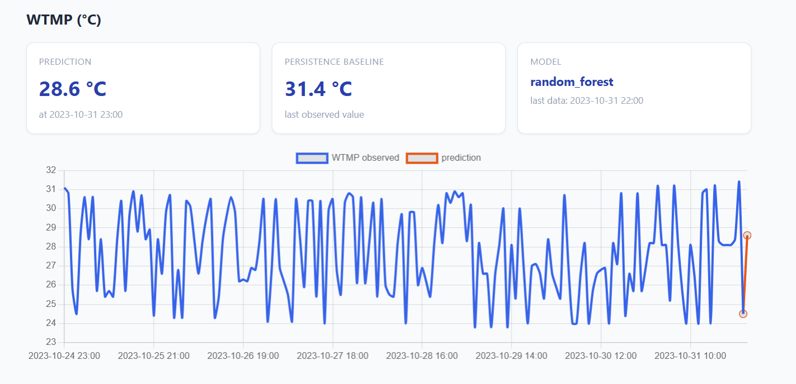
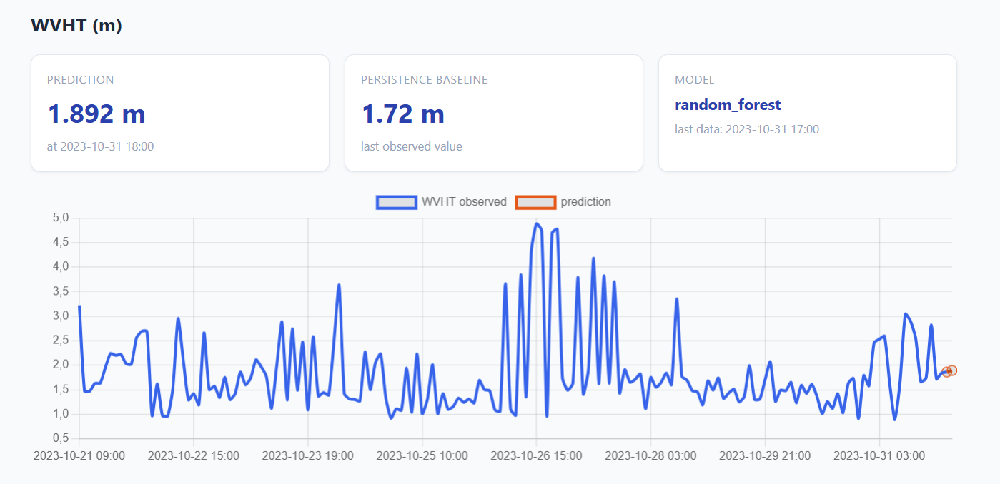
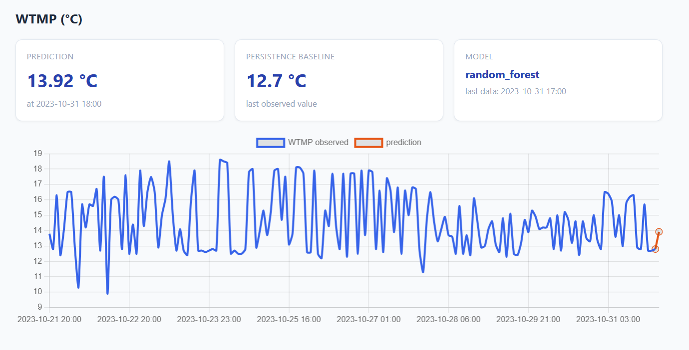

# Marine Buoy Weather Forecasting

Time-series forecasting of **WVHT** (significant wave height, m) and **WTMP** (water temperature, °C) on NOAA buoys using machine learning regression models and AutoML. Includes buoy similarity analysis via static and dynamic KMeans clustering across multiple NOAA stations. The entire project runs inside a single Docker container exposing a FastAPI REST backend and a FastAPI HTML frontend.

## Dataset

**[`Qdrant/NOAA-Buoy`](https://huggingface.co/datasets/Qdrant/NOAA-Buoy)** on Hugging Face — buoy 42002, Gulf of Mexico (26°N, 93°W), hourly measurements from **1980 to 2023** (~344,000 observations).

Additional stations downloaded from [NDBC](https://www.ndbc.noaa.gov) for clustering analysis:

| Station | Location | Use |
|---|---|---|
| **42002** | Gulf of Mexico | Forecasting + Clustering |
| **42001** | Gulf of Mexico | Forecasting + Clustering |
| **42039** | Gulf of Mexico | Clustering only |
| **46042** | Pacific (Monterey) | Forecasting + Clustering |

> **Note:** `load_dataset()` fails on the HF repo due to inconsistent CSV columns. `load.py` downloads the processed `.parquet` files directly via `huggingface_hub`.

## Project Structure

```
src/
  load.py          → download buoy 42002 from HF + extra stations from NDBC
  clean.py         → physical bounds filtering, hourly resampling (all stations)
  features.py      → lag features, rolling stats, cyclic calendar, temporal split 70/15/15
  models.py        → persistence baseline, Ridge, RandomForest, GradientBoosting (per buoy)
  automl.py        → FLAML AutoML with time-based cross-validation (60s budget, per buoy)
  clustering.py    → KMeans static (buoy profiles) + dynamic (yearly per buoy)
  predictor.py     → inference layer, loads .joblib bundles, reads clustering outputs
API_App/
  backend/main.py  → FastAPI REST API — port 8080
  backend/schemas.py → Pydantic request/response models
  frontend/main.py → FastAPI HTML frontend (Jinja2 + Chart.js) — port 8000
  frontend/templates/ → HTML templates
  static/style.css → stylesheet
  Dockerfile       → single image, supervisord starts backend and frontend
  supervisord.conf → process manager configuration
notebooks/
  summary.ipynb    → step-by-step analysis, model comparison, clustering visualization
results/           → screenshots from the running application
requirements.txt
```

## Models Compared

| Model | Description |
|---|---|
| Persistence | Naive baseline: ŷ(t+1) = y(t). No training required. |
| Ridge | Linear regression with L2 regularization. Requires StandardScaler. |
| Random Forest | Bagging ensemble of decision trees. Reduces variance. |
| Gradient Boosting | Sequential boosting ensemble. Reduces bias. |
| AutoML (FLAML) | Automatic model and hyperparameter search, 60s budget, time-based CV. |

**Selection criterion:** best model chosen on **validation RMSE** (test set used only once for final evaluation).

## Results

### Forecasting — Buoy 42002 (1980–2023, primary station)

**WVHT — Best model: Random Forest**

| Model | Val RMSE | Val R² | Test RMSE | Test R² |
|---|---|---|---|---|
| persistence | 0.1123 | 0.9741 | 0.1016 | 0.9757 |
| ridge | 0.1037 | 0.9779 | 0.0940 | 0.9792 |
| **random_forest ⭐** | **0.0996** | **0.9796** | **0.0901** | **0.9809** |
| gradient_boosting | 0.1006 | 0.9792 | 0.0908 | 0.9806 |
| xgboost (AutoML) | 0.1005 | 0.9792 | 0.0905 | 0.9807 |

**WTMP — Best model: Ridge**

| Model | Val RMSE | Val R² | Test RMSE | Test R² |
|---|---|---|---|---|
| persistence | 0.0932 | 0.9990 | 0.0886 | 0.9990 |
| **ridge ⭐** | **0.0826** | **0.9992** | **0.0826** | **0.9991** |
| random_forest | 0.0849 | 0.9991 | 0.0913 | 0.9989 |
| lgbm (AutoML) | 0.0876 | 0.9991 | 0.0935 | 0.9989 |

> Buoys 42001 and 46042 show negative R² due to limited training data (2015–2023 only, ~9 years). These buoys are valuable for clustering but insufficient for reliable forecasting.

### Clustering

**Static clustering (buoy profiles):** KMeans with k=2 (silhouette=0.236). Cluster 0: 42001, 42002, 42039 (Gulf of Mexico — similar wave and temperature regimes). Cluster 1: 46042 (Pacific — different wave heights, colder water). The separation confirms the geographic and meteorological difference between Gulf and Pacific buoys.

**Dynamic clustering (yearly profiles):** KMeans with k=2 (silhouette=0.631, 49 points). Each (buoy, year) pair is a point. Buoy 42002 remains in cluster 0 for all 43 years — stable regime. Buoy 46042 stays in cluster 1 for both available years — consistently different from Gulf buoys. No regime changes detected, confirming the stability of long-term meteorological conditions for these stations.

### Screenshots













## Run with Docker

### Pull and run (recommended — no build needed)

```bash
docker pull ghcr.io/brusca01/marine-buoy-forecasting:latest
docker run --rm -p 8000:8000 -p 8080:8080 ghcr.io/brusca01/marine-buoy-forecasting:latest
```

- Frontend → **http://localhost:8000**
- Backend API docs → **http://localhost:8080/docs**

> The Docker image already includes trained models and processed data. No pipeline execution needed.

### Build from source

All commands from the **project root** (the folder containing `src/` and `API_App/`).

**Build the image:**
```bash
docker build -f API_App/Dockerfile -t marine-buoy .
```

**Run the full pipeline (download data + train models):**

*Linux / macOS:*
```bash
docker run --rm \
  -v "$PWD/data:/app/data" \
  -v "$PWD/models:/app/models" \
  marine-buoy bash -c "
    python src/load.py &&
    python src/clean.py &&
    python src/features.py &&
    python src/models.py &&
    python src/automl.py 60 &&
    python src/clustering.py"
```

*Windows (PowerShell) — replace path with your actual project path:*
```powershell
docker run --rm -v "C:\path\to\project\data:/app/data" -v "C:\path\to\project\models:/app/models" marine-buoy bash -c "python src/load.py && python src/clean.py && python src/features.py && python src/models.py && python src/automl.py 60 && python src/clustering.py"
```

**Start the application:**
```bash
docker run --rm -p 8000:8000 -p 8080:8080 marine-buoy
```

## API Endpoints

| Method | Endpoint | Description |
|---|---|---|
| GET | `/api/health` | Service status |
| GET | `/api/stations` | List of available buoy stations |
| GET | `/api/predict` | WVHT + WTMP forecast at t+1h |
| GET | `/api/comparison` | MAE/RMSE/R² for all models and all buoys |
| GET | `/api/clusters/static` | Static buoy clustering |
| GET | `/api/clusters/dynamic` | Dynamic yearly clustering |

## GitHub Container Registry

```bash
docker tag marine-buoy ghcr.io/<username>/<repo>:latest
echo YOUR_TOKEN | docker login ghcr.io -u <username> --password-stdin
docker push ghcr.io/<username>/<repo>:latest
```
